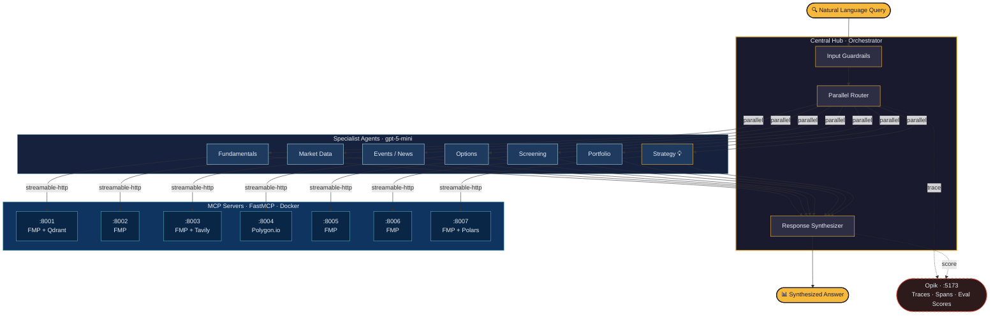

<div align="center">
  
  <br/>
  <strong>Multi-agent AI system for stock market research, powered by GPT and real-time FMP custom MCP servers.</strong>
</div>

---

## Quick Demo

```
> Compare AAPL and MSFT earnings with current options flow

OBaI routes your query to multiple specialist agents in parallel:

  Hub ──┬── Fundamentals Agent ── earnings data (AAPL, MSFT)
        ├── Events/News Agent ── recent earnings announcements
        └── Options Agent ── options flow, IV, Greeks

The Hub synthesizes all specialist outputs into a single, comprehensive response.
```

The Central Hub understands your intent, dispatches to the right specialists simultaneously (agents-as-tools pattern, not handoffs), and merges everything into one coherent answer.

---

## Architecture



The Hub receives a query, runs input guardrails, then dispatches to multiple specialists **in parallel** (agents-as-tools pattern, not handoffs). Each agent calls its MCP server over streamable-http. Results flow back to the synthesizer. [Opik](https://github.com/comet-ml/opik) (self-hosted) traces every span end-to-end and scores the final output. Strategy Agent uses `gpt-5.1` for stronger reasoning; all others use `gpt-5-mini`.

---

## Why These Data Providers

| Provider | Cost | Coverage |
|----------|------|----------|
| **FMP** (Financial Modeling Prep) | ~$19/mo | Fundamentals, market data, screening, portfolio, earnings, dividends, backtest OHLCV. One API covers 6 of 7 servers. |
| **Polygon.io** | Free tier available | Options chain data, Greeks, implied volatility, open interest. |
| **Tavily** | Free tier available | AI-optimized news search. Purpose-built for LLM consumption. |

FMP is the backbone -- it is not free, but a single subscription powers almost the entire system.

---

## Prerequisites

- **Python 3.12+**
- **uv** -- [install uv](https://docs.astral.sh/uv/getting-started/installation/)
- **Docker + Docker Compose v2** -- [Docker Engine](https://docs.docker.com/engine/install/) (Linux) or [Docker Desktop](https://docs.docker.com/desktop/) (macOS/Windows)

---

## API Keys Required

| Key | Provider | Cost | Used By |
|-----|----------|------|---------|
| `OPENAI_API_KEY` | OpenAI | Pay-per-use | All agents (Agent SDK) |
| `FMP_API_KEY` | Financial Modeling Prep | ~$19/mo | fundamentals, market-data, events-news, screening, portfolio, backtest servers |
| `POLYGON_API_KEY` | Polygon.io | Free tier | options-server only |
| `TAVILY_API_KEY` | Tavily | Free tier | events-news-server (AI search) |
| `ANTHROPIC_API_KEY` | Anthropic | Pay-per-use | *Optional* -- LLM-judge cross-family evaluation only |

---

## Quick Start

```bash
git clone https://github.com/sixteen-dev/obai.git
cd obai

# Set your API keys (add to ~/.bashrc or ~/.zshrc for persistence)
export OPENAI_API_KEY=sk-proj-...
export FMP_API_KEY=...
export POLYGON_API_KEY=...     # optional
export TAVILY_API_KEY=...      # optional

# One-shot setup: checks prereqs, starts Docker services, installs CLI
./setup.sh

# Start chatting
obai chat
```

The setup script:
1. Checks prerequisites (Docker, Python 3.12+, uv, git)
2. Validates required API keys from your shell environment
3. Creates `~/.obai/` config directory with default preferences
4. Starts Opik tracing stack (self-hosted, Docker Compose)
5. Builds and starts all 7 MCP servers (Docker Compose)
6. Installs the `obai` CLI globally via `uv tool install`
7. Configures Opik SDK for local tracing

Use `./setup.sh --skip-opik` to skip the tracing stack, or `./setup.sh --skip-mcp` to skip MCP servers.

---

## CLI Usage

```bash
# Single query (streams response to stdout)
obai query "What is AAPL trading at?"

# JSON output (for piping to other tools)
obai query "AAPL fundamentals" --json

# Named session for multi-turn conversation
obai query "What is AAPL's P/E ratio?" --session research1
obai query "How does that compare to MSFT?" --session research1

# Interactive REPL
obai chat

# Check MCP server connectivity
obai status
```

---

## MCP Servers

| Server | Port | Data Source | Key Capabilities |
|--------|------|-------------|-----------------|
| **fundamentals-server** | 8001 | FMP + Qdrant | Company financials, ratios, SEC filings, insider trades, vector search over financial education PDFs |
| **market-data-server** | 8002 | FMP | Real-time/historical prices, technical indicators |
| **events-news-server** | 8003 | FMP + Tavily | Earnings calendar, dividends, AI-powered news search |
| **options-server** | 8004 | Polygon.io | Options chains, Greeks, implied volatility, open interest |
| **screening-server** | 8005 | FMP | Stock screening with financial filters, ticker discovery |
| **portfolio-server** | 8006 | FMP | Portfolio parsing, risk analysis, ETF holdings, treasury rates |
| **backtest-server** | 8007 | FMP | Strategy backtesting with Polars + polars-talib, train/test split |

All servers use FastMCP with streamable-http transport, running inside Docker containers on a shared bridge network (`obai-mcp-network`).

---

## Strategy Agent

The Strategy Agent is OBaI's quantitative researcher. Unlike other specialists that answer questions, the Strategy Agent *builds, tests, and iterates* on trading strategies autonomously.

**How it works:** You describe a hypothesis ("momentum strategy for AAPL and MSFT") and the agent:

1. Converts your idea into a structured strategy JSON (indicators, entry/exit rules, position sizing, risk management)
2. Runs a backtest via the backtest-server (Polars + polars-talib engine)
3. Analyzes results (Sharpe, Sortino, CAGR, max drawdown, win rate, profit factor)
4. Iterates 3-5 times — adding filters, tuning parameters, refining exits
5. Validates the final candidate on out-of-sample data (train/test split)
6. Returns a verdict (`accept`, `paper_trade`, `needs_more_research`, `reject`) with the executable strategy JSON

```
> Design a mean-reversion strategy for AAPL, MSFT, and GOOGL

Strategy Agent workflow:
  Iteration 1: RSI oversold baseline         → Sharpe 0.82
  Iteration 2: Add Bollinger Band filter     → Sharpe 1.14
  Iteration 3: Tighten stop-loss from 5%→3%  → Sharpe 1.21, drawdown -8.2%
  Iteration 4: Parameter sensitivity check   → stable across ±10% range
  Iteration 5: Full-period validation        → Sharpe 1.08 (minor degradation, acceptable)

  Verdict: paper_trade
  Final strategy JSON: { ... }
```

The agent uses `gpt-5.1` by default (not `gpt-5-mini` like other specialists) because strategy design requires strong reasoning — metric interpretation, overfitting detection, and parameter sensitivity analysis.

**Backtest server tools:** `run_strategy`, `get_job_status`, `get_supported_indicators`, `download_data`, `list_available_data`, `get_trade_log`, `compare_strategies`, `clear_cache`

---

## TUI

OBaI includes a Textual-based Terminal UI with:

- Collapsible conversation history
- Hierarchical tool call display (see which agents were invoked)
- Streaming markdown responses
- Toggle-able debug panel

```bash
# From repo root
cd src/obai
uv run python -m clients.cli.tui
```

---

## Observability & Evaluation

OBaI uses [Opik](https://github.com/comet-ml/opik) (self-hosted, open source) for end-to-end tracing and evaluation. Every query generates a full trace you can inspect in the Opik UI at `http://localhost:5173`.

### What Opik Shows You

Each trace captures the complete execution graph:

- **Agent routing** — which specialists the Hub dispatched to and why
- **Tool calls** — every MCP tool invoked (function name, arguments, response), nested under the agent that called it
- **Timing** — latency breakdown per agent and per tool call, so you can spot bottlenecks
- **Token usage** — input/output tokens per LLM call across the entire query
- **Span hierarchy** — Hub → Agent → MCP Tool, fully nested and expandable

### Custom Evaluation Metrics

OBaI registers custom scorers with Opik that run on every traced query:

| Scorer | What it measures | How it works |
|--------|-----------------|--------------|
| **Faithfulness** | Is the response grounded in tool outputs? | Extracts numbers from the final response and cross-checks against raw MCP tool data. Reports `numeric_accuracy` (0-1) and a pass/fail verdict. |
| **Completeness** | Does the response address the full query? | Checks coverage of available data points from tool outputs that should appear in the answer. Reports `coverage_score` (0-1). |
| **LLM Judge** | Overall quality assessment | Cross-family evaluation using Anthropic Claude as judge (requires `ANTHROPIC_API_KEY`). Scores task completion, tool correctness, hallucination, and answer relevance. |

### Running Evaluations

```bash
# From repo root
cd src/obai

# Trace a single query (inspect in Opik UI afterward)
uv run python -m evaluation query "What is AAPL trading at?" --verbose

# Run evaluation with all scorers
uv run python -m evaluation evaluate "What is AAPL trading at?"

# Run the full test suite (categorized: A/B/C/D)
uv run python -m evaluation evaluate --suite

# Fast mode — skip LLM judge, just faithfulness + completeness
uv run python -m evaluation evaluate --suite --no-builtin

# Export markdown report
uv run python -m evaluation evaluate --suite --report results.md
```

### Opik Setup

Opik runs as a Docker Compose stack (ClickHouse + backend + frontend). The `setup.sh` script handles this automatically, or run it manually:

```bash
docker compose -f infra/opik/docker-compose.yml up -d
```

Dashboard: `http://localhost:5173` | Project: `obai-eval`

---

## Configuration

Key environment variables (all have sensible defaults):

| Variable | Default | Description |
|----------|---------|-------------|
| `ORCHESTRATOR_MODEL` | `gpt-5.1` | Model for the Central Hub (needs strong reasoning) |
| `SPECIALIST_MODEL` | `gpt-5-mini` | Model for specialist agents |
| `ENABLE_GUARDRAILS` | `true` | Input guardrails to filter non-financial queries |
| `ENABLE_INLINE_SCORING` | `true` | Run faithfulness/completeness scoring on every query |
| `OPIK_ENABLED` | `true` | Enable Opik tracing |
| `OPIK_URL` | `http://localhost:5173` | Opik server URL |
| `MCP_TIMEOUT` | `30` | MCP request timeout (seconds) |
| `LOG_LEVEL` | `INFO` | Logging level |

Per-agent model overrides are also available: `MARKET_DATA_MODEL`, `FUNDAMENTALS_MODEL`, `EVENTS_NEWS_MODEL`, `OPTIONS_MODEL`, `SCREENER_MODEL`, `PORTFOLIO_MODEL`, `STRATEGY_MODEL`.

---

## Project Structure

```
obai/
├── setup.sh                        # One-shot setup script
├── docker-compose.yml              # All 7 MCP servers
├── pyproject.toml                  # Monorepo dev tooling config
├── infra/
│   └── opik/                       # Opik tracing stack (Docker Compose)
├── src/
│   ├── fundamentals-server/        # MCP server — financials, ratios, vector search
│   ├── market-data-server/         # MCP server — prices, technicals
│   ├── events-news-server/         # MCP server — news, earnings, dividends
│   ├── options-server/             # MCP server — options chains, Greeks
│   ├── screening-server/           # MCP server — stock screening
│   ├── portfolio-server/           # MCP server — portfolio analysis, ETF holdings
│   ├── backtest-server/            # MCP server — strategy backtesting
│   └── obai/                       # Core application
│       ├── pyproject.toml          # OBaI package config
│       ├── core_agents/            # Agent definitions + orchestration
│       │   ├── central_hub_agent.py
│       │   ├── base_agent.py
│       │   ├── config.py
│       │   ├── guardrails.py
│       │   ├── prompts/            # Markdown prompt files
│       │   └── *_agent.py          # 7 specialist agents
│       ├── clients/
│       │   └── cli/                # CLI + TUI clients
│       │       ├── chat.py         # Headless CLI (obai query/chat/status)
│       │       └── tui.py          # Textual TUI
│       └── evaluation/             # Eval framework
│           ├── cli.py              # Evaluation CLI
│           ├── eval_runner.py      # Test runner
│           ├── scorers/            # Faithfulness, completeness, LLM-judge
│           ├── metrics/            # Metric definitions
│           ├── test_cases/         # Predefined test queries
│           └── trace/              # Trace capture utilities
└── tests/                          # Monorepo-level tests
```

---

## Development

```bash
# All commands run from repo root

# Lint and fix
uv run ruff check . --fix

# Format
uv run ruff format .

# Type check (strict mode)
uv run mypy src/ --strict

# Run tests
uv run pytest
```

---

## Roadmap

- [ ] Intraday timeframes (5min, 15min, 1hr bars) for backtest engine
- [ ] Download validation and retry with backoff
- [ ] Semantic caching via LangCache (Redis)
- [ ] Web client
- [ ] More data providers

---

## License

Commons Clause + Apache 2.0. Free for personal and non-commercial use. See [LICENSE](LICENSE) for details.
