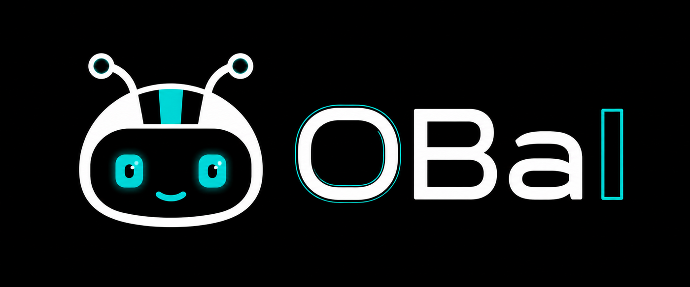

<div align="center">
  
  <br/>
  <strong>Open-source multi-agent platform for stock research, strategy backtesting, and prediction market intelligence.</strong>
  <br/>
  <sub>pronounced <i>"oww-bee"</i></sub>
  <br/><br/>
  <a href="https://medium.com/gopenai/i-built-a-wall-street-research-desk-with-ai-agents-32ac9e0221eb">Read the blog post →</a>
  &nbsp;·&nbsp;
  <a href="https://openbell.ai/obai/docs/faq">FAQ →</a>
</div>

> 💡 **New here?** Check the [FAQ](https://openbell.ai/obai/docs/faq) — covers when to start a new conversation, cost expectations, and which agent handles what.

---

## Quick Demo

<div align="center">
  <sub><i>"I want to fade the opening spike on NVDA. Backtest a 5-min mean-reversion on the first hour — enter when RSI(14) drops below 25 after 9:45, exit on RSI crossing back above 50, flat by close. Tight stop, 1.5% max. Last year of data."</i></sub>
  <br/><br/>
  <a href="https://youtu.be/62E0JBasyCQ">
    
  </a>
</div>

The Central Hub understands your intent, dispatches to the right specialists simultaneously (agents-as-tools pattern, not handoffs), and merges everything into one coherent answer.

---

## Architecture


The Hub receives a query, runs input guardrails, then dispatches to multiple specialists **in parallel** (agents-as-tools pattern, not handoffs). Each agent calls its MCP server over streamable-http. Results flow back to the synthesizer. [Opik](https://github.com/comet-ml/opik) (self-hosted) traces every span end-to-end and scores the final output. The Hub uses `gpt-5.5` for routing and synthesis, the Strategy Agent uses `gpt-5.1` for stronger backtest reasoning, and the remaining specialists use `gpt-5-mini`. The Research Agent adds deep qualitative analysis via Exa semantic search. The Prediction Markets Agent covers Polymarket with executable pricing, trade memos, wallet tracing, and setup-based backtesting. The Crypto Agent covers Coinbase spot markets with quotes, order books, OHLCV, and execution-grade spot backtests plus paper-ledger artifacts.

---

## Why These Data Providers

| Provider | Cost | Coverage |
|----------|------|----------|
| **FMP** (Financial Modeling Prep) | ~$19/mo | Fundamentals, market data, screening, portfolio, earnings, dividends, backtest OHLCV. One API covers 6 of 10 servers. |
| **Massive.com** | Free tier available | Options chain data, Greeks, implied volatility, open interest. |
| **Tavily** | Free tier available | AI-optimized news search. Purpose-built for LLM consumption. |
| **Exa** | Free tier available | Semantic search for qualitative research — company profiles, leadership, product sentiment, competitive landscape. |
| **Polymarket** | Free (public APIs) | Prediction market data — market discovery, order books, price history, trade flow, leaderboard, wallet activity. |
| **Coinbase Advanced Trade** | Free (public market data) | Spot crypto market data — product metadata, best bid/ask, order books, latest trades, OHLCV candles. No API key required. |

FMP is the backbone -- it is not free, but a single subscription powers almost the entire system.

---

## Prerequisites

- **Python 3.12+**
- **uv** -- [install uv](https://docs.astral.sh/uv/getting-started/installation/)
- **Docker + Docker Compose v2** -- [Docker Engine](https://docs.docker.com/engine/install/) (Linux) or [Docker Desktop](https://docs.docker.com/desktop/) (macOS/Windows)

---

## API Keys Required

| Key | Provider | Cost | Used By |
|-----|----------|------|---------|
| `OPENAI_API_KEY` | OpenAI | Pay-per-use | All agents (Agent SDK) |
| `FMP_API_KEY` | Financial Modeling Prep | ~$19/mo | fundamentals, market-data, events-news, screening, portfolio, backtest servers |
| `MASSIVE_API_KEY` | Massive.com | Free tier | options-server only |
| `TAVILY_API_KEY` | Tavily | Free tier | events-news-server (AI search) |
| `EXA_API_KEY` | Exa | Free tier | research-server (semantic search) |
| `ANTHROPIC_API_KEY` | Anthropic | Pay-per-use | *Optional* -- LLM-judge cross-family evaluation only |

---

## Install

```bash
curl -fsSL https://openbell.ai/install.sh | bash
```

This single command checks prerequisites, clones the repo, prompts for API keys, starts all services, and installs the `obai` CLI. Once complete:

```bash
obai chat
```

<details>
<summary>Manual setup</summary>

```bash
git clone https://github.com/sixteen-dev/obai.git
cd obai

# Set your API keys (add to ~/.bashrc or ~/.zshrc for persistence)
export OPENAI_API_KEY=sk-proj-...
export FMP_API_KEY=...
export MASSIVE_API_KEY=...     # optional
export TAVILY_API_KEY=...      # optional
export EXA_API_KEY=...         # optional

# One-shot setup: checks prereqs, starts Docker services, installs CLI
./setup.sh

# Start chatting
obai chat
```
</details>

The setup script:
1. Checks prerequisites (Docker, Python 3.12+, uv, git)
2. Validates required API keys from your shell environment
3. Creates `~/.obai/` config directory with default preferences
4. Starts Opik tracing stack (self-hosted, Docker Compose)
5. Builds and starts all 10 MCP servers (Docker Compose)
6. Installs the `obai` CLI globally via `uv tool install`
7. Launches the Web UI (FastAPI on port 8090)
8. Configures Opik SDK for local tracing

| Flag | Effect |
|------|--------|
| `--local` | Build MCP images from local source instead of pulling from GHCR |
| `--skip-opik` | Skip the Opik tracing stack |
| `--skip-mcp` | Skip MCP servers (start them later) |
| `--prompt-keys` | Interactively prompt for missing API keys |

### Pinning a Version

OBaI uses [GitHub Releases](https://github.com/sixteen-dev/obai/releases) for versioned snapshots. To install a specific version:

```bash
git checkout v0.9.0
./setup.sh
```

To update to latest: `git checkout main && git pull && ./setup.sh`

---

## CLI Usage

```bash
# Single query (streams response to stdout)
obai query "What is AAPL trading at?"

# JSON output (for piping to other tools)
obai query "AAPL fundamentals" --json

# Named session for multi-turn conversation
obai query "What is AAPL's P/E ratio?" --session research1
obai query "How does that compare to MSFT?" --session research1

# Interactive REPL
obai chat

# Check MCP server connectivity
obai status
```

---

## MCP Servers

| Server | Port | Data Source | Key Capabilities |
|--------|------|-------------|-----------------|
| **fundamentals-server** | 8001 | FMP | Company financials, ratios, SEC filings, insider trades. Qdrant-backed vector search over financial education PDFs is shipped but disabled by default (`QDRANT_ENABLED=false`). |
| **market-data-server** | 8002 | FMP | Real-time/historical prices, intraday data (5min/15min/1hr), technical indicators, index-scoped movers (S&P 500, Nasdaq, Dow Jones) |
| **events-news-server** | 8003 | FMP + Tavily | Earnings calendar, dividends, AI-powered news search |
| **options-server** | 8004 | Massive.com | Options chains, Greeks, implied volatility, open interest |
| **screening-server** | 8005 | FMP | Stock screening with financial filters, ticker discovery |
| **portfolio-server** | 8006 | FMP | Portfolio parsing, risk analysis, ETF holdings, treasury rates |
| **backtest-server** | 8007 | FMP | Strategy backtesting with Polars + polars-talib, DuckDB storage, daily + intraday (5min/15min/1hr), train/test split |
| **research-server** | 8008 | Exa | Deep qualitative research — company profiles, leadership, product sentiment, competitive landscape, general research |
| **prediction-markets-server** | 8009 | Polymarket | Market discovery, executable pricing (bid/ask/depth), price history, trade flow, holder concentration, leaderboard, wallet tracing, setup-based backtesting |
| **crypto-server** | 8010 | Coinbase Advanced Trade (public) | Spot product resolution, best bid/ask, order books, latest trades, OHLCV with source-quality checks, execution-grade spot backtests (trend/mean-reversion), trade logs, and internal paper-ledger strategy artifacts. No API key required. |

All servers use FastMCP with streamable-http transport, running inside Docker containers on a shared bridge network (`obai-mcp-network`).

---

## Strategy Agent

The Strategy Agent is OBaI's quantitative researcher. Unlike other specialists that answer questions, the Strategy Agent *builds, tests, and iterates* on trading strategies autonomously.

**How it works:** You describe a hypothesis ("momentum strategy for AAPL and MSFT") and the agent:

1. Converts your idea into a structured strategy JSON (indicators, entry/exit rules, position sizing, risk management)
2. Runs a backtest via the backtest-server (Polars + polars-talib engine, DuckDB storage)
3. Analyzes results (Sharpe, Sortino, CAGR, max drawdown, win rate, profit factor)
4. Iterates 3-5 times — adding filters, tuning parameters, refining exits
5. Validates the final candidate on out-of-sample data (train/test split)
6. Returns a verdict (`accept`, `paper_trade`, `needs_more_research`, `reject`) with the executable strategy JSON

```
> Design a mean-reversion strategy for AAPL, MSFT, and GOOGL

Strategy Agent workflow:
  Iteration 1: RSI oversold baseline         → Sharpe 0.82
  Iteration 2: Add Bollinger Band filter     → Sharpe 1.14
  Iteration 3: Tighten stop-loss from 5%→3%  → Sharpe 1.21, drawdown -8.2%
  Iteration 4: Parameter sensitivity check   → stable across ±10% range
  Iteration 5: Full-period validation        → Sharpe 1.08 (minor degradation, acceptable)

  Verdict: paper_trade
  Final strategy JSON: { ... }
```

The agent uses `gpt-5.1` by default (not `gpt-5-mini` like other specialists) because strategy design requires strong reasoning — metric interpretation, overfitting detection, and parameter sensitivity analysis.

**Backtest server tools:** `run_strategy`, `get_job_status`, `get_supported_indicators`, `download_data`, `list_available_data`, `get_trade_log`, `compare_strategies`, `clear_cache`

---

## Web UI

OBaI ships a browser-based client with a dark glassmorphism interface:

- Real-time streaming via WebSocket
- Session management with persistent conversation history
- Live agent activity panel showing tool calls and specialist routing
- Portfolio preferences and Opik trace links in settings

```bash
obai web                  # Launch on http://127.0.0.1:8090
obai web --port 3000      # Custom port
```

The web UI is automatically started by `setup.sh`. It runs a single-process FastAPI/uvicorn server with minimal resource overhead — the heavy computation happens in the MCP servers (Docker) and the OpenAI API (remote).

---

## TUI

OBaI includes a Textual-based Terminal UI with:

- Collapsible conversation history
- Hierarchical tool call display (see which agents were invoked)
- Streaming markdown responses
- Toggle-able debug panel

```bash
# From repo root
cd src/obai
uv run python -m clients.cli.tui
```

---

## Observability & Evaluation

OBaI uses [Opik](https://github.com/comet-ml/opik) (self-hosted, open source) for end-to-end tracing and evaluation. Every query generates a full trace you can inspect in the Opik UI at `http://localhost:5173`.

### What Opik Shows You

Each trace captures the complete execution graph:

- **Agent routing** — which specialists the Hub dispatched to and why
- **Tool calls** — every MCP tool invoked (function name, arguments, response), nested under the agent that called it
- **Timing** — latency breakdown per agent and per tool call, so you can spot bottlenecks
- **Token usage** — input/output tokens per LLM call across the entire query
- **Span hierarchy** — Hub → Agent → MCP Tool, fully nested and expandable

### Custom Evaluation Metrics

OBaI registers custom scorers with Opik that run on every traced query:

| Scorer | What it measures | How it works |
|--------|-----------------|--------------|
| **Faithfulness** | Is the response grounded in tool outputs? | Extracts numbers from the final response and cross-checks against raw MCP tool data. Reports `numeric_accuracy` (0-1) and a pass/fail verdict. |
| **Completeness** | Does the response address the full query? | Checks coverage of available data points from tool outputs that should appear in the answer. Reports `coverage_score` (0-1). |
| **LLM Judge** | Overall quality assessment | Cross-family evaluation using Anthropic Claude as judge (requires `ANTHROPIC_API_KEY`). Scores task completion, tool correctness, hallucination, and answer relevance. |

### Running Evaluations

```bash
# From repo root
cd src/obai

# Trace a single query (inspect in Opik UI afterward)
uv run python -m evaluation query "What is AAPL trading at?" --verbose

# Run evaluation with all scorers
uv run python -m evaluation evaluate "What is AAPL trading at?"

# Run the full test suite (176 cases, categories: A/B/C/D/E/G/H)
uv run python -m evaluation evaluate --suite

# Fast mode — skip LLM judge, just faithfulness + completeness
uv run python -m evaluation evaluate --suite --no-builtin

# Export markdown report
uv run python -m evaluation evaluate --suite --report results.md
```

### Opik Setup

Opik runs as a Docker Compose stack (ClickHouse + backend + frontend). The `setup.sh` script handles this automatically, or run it manually:

```bash
./infra/opik/setup-volumes.sh
docker compose -f infra/opik/docker-compose.yml up -d
```

Dashboard: `http://localhost:5173` | Project: `obai-eval`

---

## Configuration

Key environment variables (all have sensible defaults):

| Variable | Default | Description |
|----------|---------|-------------|
| `ORCHESTRATOR_MODEL` | `gpt-5.5` | Model for the Central Hub (needs strong reasoning) |
| `SPECIALIST_MODEL` | `gpt-5-mini` | Model for specialist agents |
| `ENABLE_GUARDRAILS` | `true` | Input guardrails to filter non-financial queries |
| `ENABLE_INLINE_SCORING` | `true` | Run faithfulness/completeness scoring on every query |
| `OPIK_ENABLED` | `true` | Enable Opik tracing |
| `OPIK_URL` | `http://localhost:5173` | Opik server URL |
| `MCP_TIMEOUT` | `30` | MCP request timeout (seconds) |
| `LOG_LEVEL` | `INFO` | Logging level |

Per-agent model overrides are also available: `MARKET_DATA_MODEL`, `FUNDAMENTALS_MODEL`, `EVENTS_NEWS_MODEL`, `OPTIONS_MODEL`, `SCREENER_MODEL`, `PORTFOLIO_MODEL`, `STRATEGY_MODEL`, `RESEARCH_MODEL`, `PREDICTION_MARKETS_MODEL`.

---

## User Preferences

OBaI stores personal preferences in `~/.obai/preferences.json`. These persist across sessions and are used by agents to tailor responses and backtests to your profile.

| Preference | Default | Description |
|------------|---------|-------------|
| `risk_tolerance` | `moderate` | `conservative`, `moderate`, or `aggressive` |
| `investment_horizon` | `medium` | `short` (<3yr), `medium` (3-10yr), or `long` (>10yr) |
| `default_benchmark` | `SPY` | Benchmark symbol for comparisons |
| `initial_capital` | `100000` | Starting capital for backtests |
| `currency` | `USD` | Currency code |
| `market` | `US` | Market scope |

**Update via chat** — just tell OBaI in conversation:

```
> Set my initial capital to 50000
> Change my risk tolerance to aggressive
> What are my current preferences?
```

The agents use `get_preferences` and `set_preferences` tools automatically.

**Update manually** — edit `~/.obai/preferences.json` directly:

```json
{
  "risk_tolerance": "moderate",
  "investment_horizon": "medium",
  "default_benchmark": "SPY",
  "initial_capital": 50000,
  "currency": "USD",
  "market": "US"
}
```

---

## Project Structure

```
obai/
├── setup.sh                        # One-shot setup script
├── docker-compose.yml              # All 10 MCP servers
├── pyproject.toml                  # Monorepo dev tooling config
├── infra/
│   └── opik/                       # Opik tracing stack (Docker Compose)
├── src/
│   ├── fundamentals-server/        # MCP server — financials, ratios, vector search
│   ├── market-data-server/         # MCP server — prices, technicals
│   ├── events-news-server/         # MCP server — news, earnings, dividends
│   ├── options-server/             # MCP server — options chains, Greeks
│   ├── screening-server/           # MCP server — stock screening
│   ├── portfolio-server/           # MCP server — portfolio analysis, ETF holdings
│   ├── backtest-server/            # MCP server — strategy backtesting
│   ├── research-server/            # MCP server — qualitative research (Exa)
│   ├── prediction-markets-server/  # MCP server — Polymarket analysis (no API keys)
│   ├── crypto-server/              # MCP server — Coinbase spot crypto (no API keys)
│   └── obai/                       # Core application
│       ├── pyproject.toml          # OBaI package config
│       ├── core_agents/            # Agent definitions + orchestration
│       │   ├── central_hub_agent.py
│       │   ├── base_agent.py
│       │   ├── config.py
│       │   ├── guardrails.py
│       │   ├── prompts/            # Markdown prompt files
│       │   └── *_agent.py          # 10 specialist agents
│       ├── clients/
│       │   ├── cli/                # CLI + TUI clients
│       │   │   ├── chat.py         # Headless CLI (obai query/chat/status)
│       │   │   └── tui.py          # Textual TUI
│       │   └── web/                # Browser client
│       │       ├── server.py       # FastAPI + WebSocket server
│       │       └── static/         # SPA (HTML, CSS, JS)
│       └── evaluation/             # Eval framework
│           ├── cli.py              # Evaluation CLI
│           ├── eval_runner.py      # Test runner
│           ├── scorers/            # Faithfulness, completeness, LLM-judge
│           ├── metrics/            # Metric definitions
│           ├── test_cases/         # Predefined test queries
│           └── trace/              # Trace capture utilities
└── tests/                          # Monorepo-level tests
```

---

## Development

```bash
# All commands run from repo root

# Lint and fix
uv run ruff check . --fix

# Format
uv run ruff format .

# Type check (strict mode)
uv run mypy src/ --strict

# Run tests
uv run pytest
```

---

## Agent Skills

OBaI ships with agent skills that let any AI agent autonomously interact with the system:

**[OBaI Query Skill](skills/obai/SKILL.md)** — Read-only financial research. The agent runs `obai query` commands directly, manages sessions, parses JSON responses, and presents answers. Ask any financial question and it routes to the right specialist automatically.

**[OBaI MCP Skill Suite](skills/obai-hub/SKILL.md)** — Direct-MCP alternative to the query skill for agents that support both skills and MCP (Claude Code, OpenClaw, etc.). Instead of going through the OBaI hub agent, the host agent itself plays the hub: the [`obai-hub`](skills/obai-hub/SKILL.md) skill routes intent and enforces grounding/synthesis rules, and ten specialist skills (`obai-market-data`, `obai-fundamentals`, `obai-events-news`, `obai-options`, `obai-screening`, `obai-portfolio`, `obai-strategy`, `obai-research`, `obai-prediction-markets`, `obai-crypto`) carry the curated specialist playbooks for each MCP server on its fixed port (8001–8010). Register the servers from [`skills/obai-hub/mcp-config.json`](skills/obai-hub/mcp-config.json). No OpenAI key needed — the host agent's model does the reasoning.

**[AutoTrader Skill](skills/autotrader/SKILL.md)** — Autonomous paper trading bot on Alpaca. Combines OBaI analysis (read-only) with Alpaca execution (trades) to manage a stock portfolio. Evaluates strategy signals against deployed strategies, executes trades with built-in risk checks (position sizing, exposure limits, daily loss caps), and maintains a trading journal. Requires `ALPACA_API_KEY` and `ALPACA_SECRET_KEY`.

---

## Roadmap

### Done

- [x] FastMCP servers with pure MCP protocol (streamable-http)
- [x] Real-time market data integration (FMP API)
- [x] Multi-agent orchestration with OpenAI Agent SDK (agents-as-tools)
- [x] Self-hosted local infrastructure (Docker Compose, no cloud dependency)
- [x] CLI client (`obai query`, `obai chat`, `obai status`)
- [x] Textual TUI with streaming markdown and agent activity
- [x] Tavily-powered AI news search
- [x] Options server (Massive.com — chains, Greeks, IV, open interest)
- [x] Backtest engine (Polars + polars-talib, train/test split)
- [x] Strategy Agent with autonomous iteration loop
- [x] Opik tracing and custom evaluation scorers
- [x] Input guardrails for non-financial query filtering
- [x] Qdrant vector search over financial education PDFs (shipped; disabled by default)
- [x] Research server — deep qualitative analysis via Exa semantic search
- [x] DuckDB storage for backtest OHLCV data (replaced Parquet-per-symbol)
- [x] Intraday timeframes (5min, 15min, 1hr bars) for backtest engine and market data
- [x] AutoTrader skill — autonomous paper trading on Alpaca with risk management

### Next

- [ ] Options strategy analysis and backtesting
- [x] Polymarket prediction market analysis (11 tools, executable pricing, trade memos, wallet tracing)
- [ ] Crypto market analysis
- [ ] Semantic caching via LangCache (Redis)
- [x] Web client (FastAPI + WebSocket, dark glassmorphism UI)

---

## License

Commons Clause + Apache 2.0. Free for personal and non-commercial use. See [LICENSE](LICENSE) for details.
