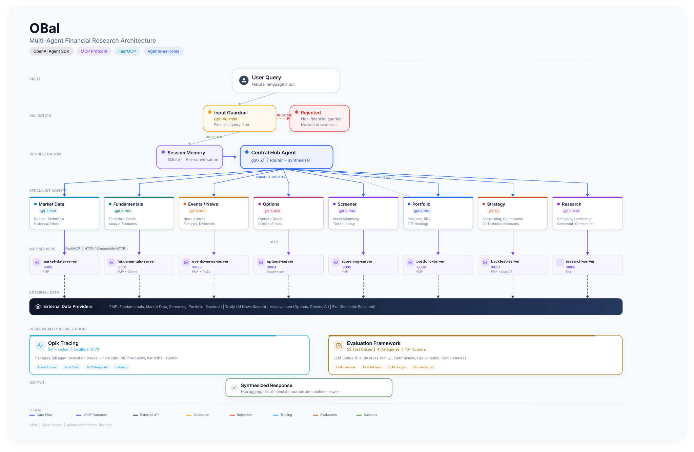

# OBaI - Financial Research Assistant

**OBaI** (pronounced like Oww-bee) is a multi-agent platform for stock research, strategy backtesting, and prediction market intelligence, built with:
- **OpenAI Agent SDK** for agent orchestration
- **MCP (Model Context Protocol)** for tool integration
- **Multi-specialist architecture** (agents-as-tools, not handoffs)

## Project Structure

```
OBaI/
├── core_agents/                   # Core agent system
│   ├── central_hub_agent.py     # Routes queries to specialists
│   ├── market_data_agent.py     # Quotes, prices, technicals, intraday
│   ├── fundamentals_agent.py    # Financials, ratios, estimates
│   ├── events_news_agent.py     # News, earnings, dividends
│   ├── options_agent.py         # Options chains, Greeks
│   ├── screener_agent.py        # Stock screening, ticker lookup
│   ├── portfolio_agent.py       # Portfolio parsing, risk prefs, ETF holdings
│   ├── strategy_agent.py       # Backtesting, strategy design, optimization
│   ├── research_agent.py       # Qualitative research via Exa semantic search
│   ├── prediction_markets_agent.py  # Polymarket analysis, trade memos
│   ├── mcp/                     # MCP client integration
│   │   ├── client.py            # HTTP client for MCP servers
│   │   └── tool_converter.py   # MCP tools → Agent SDK format
│   ├── prompts/                 # Agent instruction files (markdown)
│   ├── tracing/                 # Opik tracing (opik_init.py)
│   ├── config.py                # Pydantic settings
│   ├── prompt_loader.py         # Load prompts from files
│   └── tests/                   # Unit tests
│
├── evaluation/                   # Evaluation framework
│   ├── cli.py                   # Typer CLI (query, evaluate, list-tests)
│   ├── eval_runner.py           # Evaluation orchestration + YAML loader
│   ├── test_cases/
│   │   └── suite.yaml           # 139 test cases (categories A-E, G)
│   ├── trace/                   # Trace capture
│   │   ├── capture.py           # TraceCapture class
│   │   └── types.py             # Pydantic trace models
│   ├── scorers/                 # Scoring system
│   │   ├── builtin.py           # Opik built-in scorers
│   │   ├── custom.py            # OBaI-specific scorers
│   │   ├── llm_judge.py         # LLM-judge rubric scorer
│   │   └── faithfulness.py      # Faithfulness + completeness scorers
│   └── metrics/                 # Custom metrics
│       └── sequencing.py        # Agent call sequence validation
│
└── clients/                      # Client applications
    └── cli/                      # CLI clients
        ├── tui.py                # Textual TUI app
        ├── chat.py               # Headless CLI (obai command)
        ├── widgets.py            # Custom Textual widgets
        └── test_connection.py    # MCP server connectivity test
```

## Quick Start

### 1. Start MCP Servers

```bash
# Using Docker Compose (recommended)
docker compose up -d

# Or start individually
cd src/fundamentals-server && uv run fastmcp run server.py   # :8001
cd src/market-data-server && uv run fastmcp run server.py    # :8002
cd src/events-news-server && uv run fastmcp run server.py    # :8003
cd src/options-server && uv run fastmcp run server.py        # :8004
cd src/screening-server && uv run fastmcp run server.py      # :8005
cd src/portfolio-server && uv run fastmcp run server.py      # :8006
cd src/backtest-server && uv run fastmcp run server.py       # :8007
cd src/research-server && uv run fastmcp run server.py       # :8008
cd src/prediction-markets-server && uv run python -m src.server  # :8009
```

### 2. Set Environment Variables

```bash
export OPENAI_API_KEY=sk-proj-...
export MCP_FUNDAMENTALS_URL=http://localhost:8001/mcp
export MCP_MARKET_DATA_URL=http://localhost:8002/mcp
export MCP_EVENTS_NEWS_URL=http://localhost:8003/mcp
export MCP_OPTIONS_URL=http://localhost:8004/mcp
export MCP_SCREENER_URL=http://localhost:8005/mcp
export MCP_PORTFOLIO_URL=http://localhost:8006/mcp
export MCP_BACKTEST_URL=http://localhost:8007/mcp
export MCP_RESEARCH_URL=http://localhost:8008/mcp
export MCP_PREDICTION_MARKETS_URL=http://localhost:8009/mcp
export EXA_API_KEY=...                                    # research-server
```

See `clients/cli/.env.example` for all available options.

### 3. Install Dependencies

```bash
cd src/OBaI
uv sync
```

### 4. Run the TUI

```bash
cd src/OBaI
uv run python -m clients.cli.tui
```

Features:
- Collapsible conversation history
- Hierarchical tool call display with status indicators
- Streaming markdown responses
- Toggle-able debug panel

### 5. Headless CLI

```bash
cd src/OBaI && uv sync

# Single query (streams to stdout)
obai query "What is AAPL trading at?"

# JSON output (for programmatic use / agent-to-agent)
obai query "What is AAPL trading at?" --json

# Named session for multi-turn conversations
obai query "AAPL price" --session s1
obai query "What about its P/E?" --session s1

# Interactive chat REPL
obai chat

# Check MCP server connectivity
obai status
```

### 6. Test MCP Connectivity

```bash
cd src/OBaI/clients/cli
uv run python test_connection.py
```

## Agent Architecture



### Key Components

**Input Guardrail** (gpt-4o-mini): Validates queries before processing. Rejects non-financial questions to save API costs.

**Central Hub** (gpt-5.5): Routes queries to specialists, calls them as tools (parallel when possible), synthesizes responses.

**Specialists** (9 agents, each with dedicated MCP server):
1. **Market Data Agent** (:8002): Real-time quotes, historical + intraday prices, technical indicators
2. **Fundamentals Agent** (:8001): Financial statements, ratios, analyst estimates
3. **Events/News Agent** (:8003): News articles, earnings calendar, dividends
4. **Options Agent** (:8004): Options chains, Greeks, strike selection
5. **Screener Agent** (:8005): Stock screening, ticker lookup
6. **Portfolio Agent** (:8006): Portfolio parsing, risk preferences, ETF holdings, Treasury rates
7. **Strategy Agent** (:8007): Trading strategy design, backtesting (daily + intraday), optimization, performance metrics (Sharpe, Sortino, drawdown, alpha/beta). Uses gpt-5.1 for strong reasoning. Backed by DuckDB for OHLCV storage with 20 technical indicators via polars-talib.
8. **Research Agent** (:8008): Deep qualitative research via Exa semantic search — company profiles, leadership, product sentiment, competitive landscape.
9. **Prediction Markets Agent** (:8009): Polymarket market discovery, executable bid/ask/depth, trade decision memos, trader leaderboard, wallet tracing, setup-based backtesting. Uses public APIs (no keys required).

**Session**: Automatic conversation memory via OpenAI Agent SDK Sessions.
- TUI: In-memory SQLiteSession (ephemeral)

### Cross-Domain Query Handling

When a query needs data from multiple domains, the **Central Hub orchestrates**:

```
User: "What's my portfolio worth? I have AAPL 50%, MSFT 50%"
                    ↓
            Central Hub (gpt-5.5)
            /                  \
   portfolio_analysis      market_data_analysis
   (parse positions)         (get prices)
            \                  /
            Central Hub synthesizes:
            "Your portfolio: AAPL @ $185 (50%) + MSFT @ $420 (50%) = ..."
```

Key points:
- Each specialist only has access to its own MCP tools
- The Central Hub calls multiple specialists **in parallel** when needed
- Hub receives ALL outputs and synthesizes the final response
- Specialists don't call each other directly

## Configuration

### Models

```bash
export ORCHESTRATOR_MODEL=gpt-5.5      # Needs strong reasoning
export SPECIALIST_MODEL=gpt-5-mini    # Cost-effective for tools
```

Per-agent overrides:
```bash
export MARKET_DATA_MODEL=gpt-5-mini         # Override for specific agent
export STRATEGY_MODEL=gpt-5.1               # Strategy default; cheaper than the hub's gpt-5.5 with comparable backtest output
```

### Prompts

Agent instructions are in `core_agents/prompts/*.md` files. Edit these to tune agent behavior. Changes take effect immediately (no code changes needed).

### Input Guardrails

```bash
# Enable (default)
export ENABLE_GUARDRAILS=true

# Disable (development only)
export ENABLE_GUARDRAILS=false
```

To customize what's allowed/rejected, edit `core_agents/prompts/guardrail.md`.

## Development

### Running Tests

```bash
cd src/OBaI
uv run pytest core_agents/tests/ -v
```

### Type Checking

```bash
uv run mypy . --strict
```

### Linting

```bash
uv run ruff check . --fix
uv run ruff format .
```

## Evaluation Framework

OBaI includes a comprehensive evaluation framework for debugging and scoring agent behavior. Built on **Opik** (self-hosted) for tracing and evaluation.

### Quick Start

```bash
# Run a single query with trace capture
uv run python -m evaluation query "What is AAPL trading at?" --verbose

# Evaluate with all scorers
uv run python -m evaluation evaluate "What is AAPL trading at?"

# Run the full test suite (139 cases from YAML)
uv run python -m evaluation evaluate --suite

# Run a single category
uv run python -m evaluation evaluate --suite --category A

# Run guardrail tests only
uv run python -m evaluation evaluate --suite --category C --no-builtin

# Custom YAML test file
uv run python -m evaluation evaluate --suite --file custom.yaml

# Export markdown report
uv run python -m evaluation evaluate --suite --report report.md

# Export JSON results + markdown report
uv run python -m evaluation evaluate --suite --export results.json --report report.md

# List available test cases
uv run python -m evaluation list-tests
uv run python -m evaluation list-tests --category B
```

### CLI Commands

| Command | Description |
|---------|-------------|
| `query` | Run query with trace capture (debugging) |
| `evaluate` | Run query + score with all scorers (`--report` for markdown, `--export` for JSON) |
| `list-tests` | Show test cases from YAML suite (filterable by `--category`) |
| `test-connection` | Verify MCP server connectivity |

### Test Suite

Test cases are defined in `evaluation/test_cases/suite.yaml` (176 cases across 7 categories):

| Category | Count | Description |
|----------|-------|-------------|
| A | 31 | Single-agent queries (price, fundamentals, news, options, portfolio, strategy) |
| B | 28 | Multi-agent with sequencing (ticker→price, screen→analyze, backtest flows) |
| C | 9 | Guardrail tests (reject non-financial, accept valid) |
| D | 10 | Error handling (invalid symbol, timeout, malformed) |
| E | 34 | Strategy & backtesting (intraday, daily, multi-indicator, optimization) |
| G | 42 | Advanced capabilities (portfolio risk, options analytics, prediction markets) |
| H | 22 | Deep company research (Exa-powered semantic search, synthesis) |

Suite runs print an aggregate summary with per-category pass/fail stats and failure details.

### Scorers

**Built-in Opik Scorers (LLM-based):**
- `HallucinationScorer` - Detects hallucinated facts not grounded in tool outputs
- `AnswerRelevanceScorer` - Rates response relevancy to the query
- `TaskCompletionScorer` - Assesses whether the agent completed the task
- `ToolCorrectnessScorer` - Assesses whether tools were used correctly

**Custom OBaI Scorers:**
- `ToolOrchestrationScorer` - Validates correct specialist agents were called
- `SequenceScorer` - Validates agent call order for dependency queries
- `ResponseQualityScorer` - Basic quality checks (length, numbers, ticker mentions)
- `EfficiencyScorer` - Checks for redundant calls, budget compliance

**LLM-Judge Rubric Scorer:**
- `LLMJudgeScorer` - Multi-dimensional scoring (accuracy, completeness, actionability, citation quality, synthesis quality)

**Ground-Truth Verification Scorers:**
- `FaithfulnessScorer` - Two-phase (deterministic numeric + LLM semantic) verification that the agent faithfully represents API data
- `CompletenessScorer` - LLM-based check for omitted relevant data with severity grading

### Opik Tracing

Traces are automatically sent to the self-hosted Opik instance when `OPIK_ENABLED=true` (default).

```bash
# First-time setup
./infra/opik/setup-volumes.sh

# Start Opik
docker compose -f infra/opik/docker-compose.yml up -d

# Configure SDK
opik configure --use_local
```

View traces at [http://localhost:5173](http://localhost:5173).

Requires `ANTHROPIC_API_KEY` for LLM-judge scorers (uses Claude as cross-family judge).

### MCP Inspector

Use the MCP Inspector to interactively browse tools and debug servers:

```bash
npx @modelcontextprotocol/inspector
```

## Architecture Decisions

**Bundled Deployment**: Agents + clients in one container. Direct Python imports, no API layer.

**File-Based Prompts**: Easy to iterate, git-tracked with diffs, no code changes for prompt updates.

**Configurable Models**: Switch models via env vars. Per-agent customization for cost optimization.

**MCP Integration**: Clean separation between agents and tools. Add new tools without changing agent code.

**Agents-as-Tools**: Central Hub calls specialists as tools (not handoffs). Hub maintains full control over orchestration and response synthesis.

**DuckDB Storage**: Backtest server uses embedded DuckDB for OHLCV data storage (replaced Parquet-per-symbol), with incremental updates and concurrent read/write support.

**Intraday Support**: Market Data Agent and Strategy Agent support intraday timeframes (5min, 15min, 1hour) in addition to daily data. Intraday data retention: 2 years for 5min/15min, 5 years for 1hour.

---

**Last Updated**: 2026-03-27
